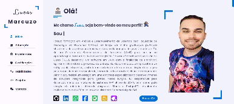

<h1>👨🏻‍💻 Meu Portfólio 💻</h1>

<a href="https://lucasmarcuzo.com">

  

# 🛠 Tecnologias utilizadas:

## 📱 Contato:

    
      
      
    
    
    
   

 <h3> - Obrigado pela visita! ✌🏻 </h3> 
 

  </h3>

